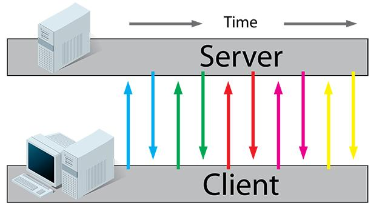
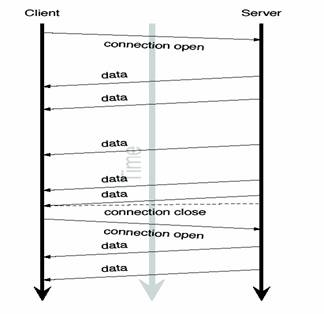
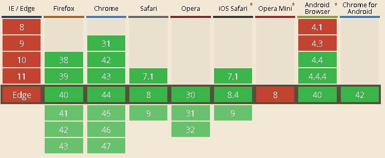
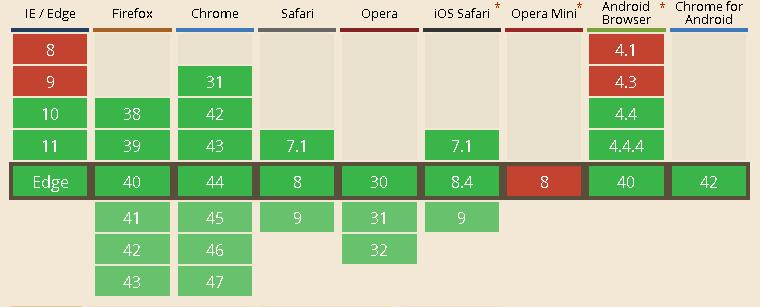
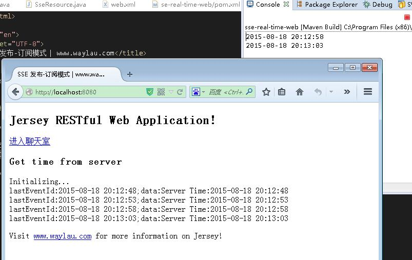
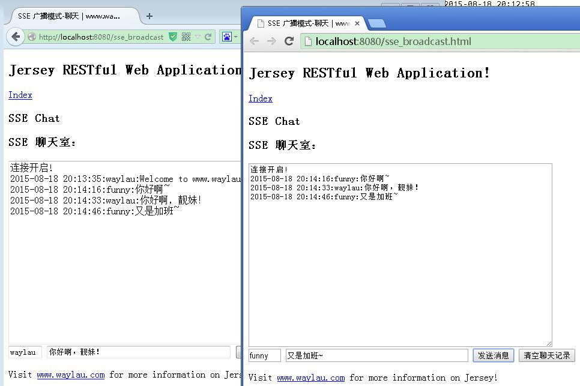

用 SSE 构建实时 Web 应用
====

在标准的 HTTP 请求-响应的情况下,客户端打开一个连接,发送一个 HTTP请求(例如 HTTP GET 请求)到服务端,然后接收到 HTTP 回来的响应，一旦这个响应完全被发送或者接收，服务端就关闭连接。当客户端需要请求所有数据时,这通常总是由一个客户发起。

相反, Server-Sent Events (SSE) 是一种机制,一旦由客户端建立客户机-服务器的连接，就能让服务端异步地将数据从服务端推到客户端。当连接由客户端建立完成,服务端就提供数据,并决定新数据“块"可用时将其发送到客户端。当一个新的数据事件发生在服务端时,这个事件被服务端发送到客户端。因此,名称被称为 Server-Sent Events（服务器推送事件）。下面是支持服务端到客户端交互的技术总览:

* 插件提供 socket 方式：比如利用 Flash XMLSocket，Java Applet 套接口，Activex 包装的 socket。
	* 优点：原生 socket 的支持，与 PC 端的实现方式相似；
	* 缺点：浏览器端需要装相应的插件；与 js 进行交互时复杂

* Polling：轮询，重复发送新的请求到服务端。如果服务端没有新的数据，就发送适当的指示并关闭连接。然后客户端等待一段时间后,发送另一个请求(例如,一秒后)
	* 优点：实现简单，无需做过多的更改
	* 缺点：轮询的间隔过长，会导致用户不能及时接收到更新的数据；轮询的间隔过短，会导致查询请求过多，增加服务器端的负担。
	

* Long-polling：长轮询，客户端发送一个请求到服务端，如果服务端没有新的数据，就保持住这个连接直到有数据。一旦服务端有了数据（消息）给客户端，它就使用这个连接发送数据给客户端。接着连接关闭。
	* 优点：比 Polling 做了优化，有较好的时效性
	* 缺点：需第三方库支持，实现较为复杂；每次连接只能发送一个数据，多个数据发送时耗费服务器性能

* 基于 iframe 及 htmlfile 的流（streaming）方式：iframe 流方式是在页面中插入一个隐藏的 iframe，利用其src属性在服务器和客户端之间创建一条长链接，服务器向 iframe 传输数据（通常是 HTML，内有负责插入信息的 javascript），来实时更新页面。
	* 优点：消息能够实时到达；
	* 缺点：服务器维持着长连接期会消耗资源；iframe 不规范的用法；数据推送过程会有加载进度条显示，界面体验不好
	

* Server-Sent events：SSE 与 长轮询机制类似,区别是每个连接不只发送一个消息。客户端发送一个请求，服务端就保持这个连接直到有一个新的消息已经准备好了,那么它将消息发送回客户端,同时仍然保持这个连接是打开,这样这个连接就可以用于另一个可用消息的发送。一旦准备好了一个新消息,通过同一初始连接发送回客户端。客户端单独处理来自服务端传回的消息后不关闭连接。所以,SSE 通常重用一个连接处理多个消息(称为事件)。SSE 还定义了一个专门的媒体类型 [text/event-stream](http://www.w3.org/TR/2009/WD-eventsource-20091029/#text-event-stream),描述一个从服务端发送到客户端的简单格式。SSE 还提供在大多数现代浏览器里的标准 javascript 客户端 API 实现。关于 SSE 的更多信息,请参见 [SSE API 规范](http://www.w3.org/TR/2009/WD-eventsource-20091029/)。
	* 优点：HTML5 标准；实现较为简单；一个连接可以发送多个数据
	* 缺点：IE 不支持 EventSource ；服务器只能单向推送数据到客户端

* WebSocket: WebSocket 与上述技术都不同，因为它提供了一个真正的全双工连接。发起者是一个客户端，发送一个带特殊 HTTP 头的请求到服务端,通知服务器， HTTP 连接可能“升级”到一个全双工的 TCP/IP WebSocket 连接。如果服务端支持 WebSocket,它可能会选择升级到 WebSocket。一旦建立 WebSocket 连接,它可用于客户机和服务器之间的双向通信。客户端和服务器可以随意向对方发送数据。此时，新的 WebSocket 连接上的交互不再是基于 HTTP 协议了。 WebSocket 可以用于需要快速在两个方向上交换小块数据的在线游戏或任何其他应用程序。(示例可以参考<http://www.waylau.com/netty-websocket-chat/>)
	* 优点：HTML5 标准；大多数浏览器支持；真正全双工；性能强
	* 缺点：实现相对复杂；ws 协议
	

## SSE vs. WebSocket

概括来说，WebSocket能做的，SSE也能做，反之亦然，但在完成某些任务方面，它们各有千秋。

WebSocket 是一种更为复杂的服务端实现技术，但它是真正的双向传输技术，既能从服务端向客户端推送数据，也能从客户端向服务端推送数据。

WebSocket 和 SSE 的浏览器支持率差不多,除了IE。IE是个例外，即便IE11都还不支持原生 SSE，IE10 添加了WebSocket 支持，可见上图。

与 WebSocket 相比，SSE 有一些显著的优势。我认为它最大的优势就是便利：不需要添加任何新组件，用任何你习惯的后端语言和框架就能继续使用。你不用为新建虚拟机、弄一个新的IP或新的端口号而劳神，就像在现有网站中新增一个页面那样简单。我喜欢把这称为既存基础设施优势。

SSE 的第二个优势是服务端的简洁。我们将在下节中看到，服务端代码只需几行。相对而言，WebSocket 则很复杂，不借助辅助类库基本搞不定。

因为 SSE 能在现有的 HTTP/HTTPS 协议上运作，所以它能直接运行于现有的代理服务器和认证技术。而对 WebSocket 而言，代理服务器需要做一些开发（或其他工作）才能支持，在写这本书时，很多服务器还没有（虽然这种状况会改善）。SSE还有一个优势：它是一种文本协议，脚本调试非常容易。事实上，在本书中，我们会在开发和测试时用 curl，甚至直接在命令行中运行后端脚本。

不过，这就引出了 WebSocket 相较 SSE 的一个潜在优势：WebSocket 是二进制协议，而 SSE 是文本协议（通常使用UTF-8编码）。当然，我们可以通过SSE连接传输二进制数据：在 SSE 中，只有两个具有特殊意义的字符，它们是 CR 和LF，而对它们进行转码并不难。但用 SSE 传输二进制数据时数据会变大，如果需要从服务端到客户端传输大量的二进制数据，最好还是用 WebSocket。

WebSocket 相较 SSE 最大的优势在于它是双向交流的，这意味向服务端发送数据就像从服务端接收数据一样简单。用 SSE时，一般通过一个独立的 Ajax 请求从客户端向服务端传送数据。相对于 WebSocket，这样使用 Ajax 会增加开销，但也就多一点点而已。如此一来，问题就变成了“什么时候需要关心这个差异？”如果需要以1次/秒或者更快的频率向服务端传输数据，那应该用 WebSocket。0.2次/秒到1次/秒的频率是一个灰色地带，用 WebSocket 和用 SSE 差别不大；但如果你期望重负载，那就有必要确定基准点。频率低于0.2次/秒左右时，两者差别不大。

从服务端向客户端传输数据的性能如何？如果是文本数据而非二进制数据（如前文所提到的），SSE和WebSocket没什么区别。它们都用TCP/IP套接字，都是轻量级协议。延迟、带宽、服务器负载等都没有区别。

在旧版本浏览器上的兼容，WebSocket 难兼容，SSE 易兼容。

## SSE 的应用场景

看了上述的定义，可以知道 SSE 适合应用于服务端单向推送信息到客户端的场景。 Jersey 的 SSE 大致可以分为发布-订阅模式和广播模式。

为使用 Jersey SSE, 添加如下依赖:

	<dependency>
	    <groupId>org.glassfish.jersey.media</groupId>
	    <artifactId>jersey-media-sse</artifactId>
	</dependency> 

### 发布-订阅模式

#### 服务端代码：

	@Path("see-events")
	public class SseResource {
	
	    private EventOutput eventOutput = new EventOutput();
	    private OutboundEvent.Builder eventBuilder;
	    private OutboundEvent event ;
	    
	    /**
	     * 提供 SSE 事件输出通道的资源方法
	     * @return eventOutput
	     */
	 	@GET
	    @Produces(SseFeature.SERVER_SENT_EVENTS)
	    public EventOutput getServerSentEvents() {
	
	 		// 不断循环执行
	        while (true) {
	        	SimpleDateFormat df = new SimpleDateFormat("yyyy-MM-dd HH:mm:ss");//设置日期格式
	        	String now =  df.format(new Date()); //获取当前系统时间
	        	String message = "Server Time:" + now;
	        	System.out.println( message );
	            
	        	eventBuilder = new OutboundEvent.Builder();
	        	eventBuilder.id(now);
	            eventBuilder.name("message");
	            eventBuilder.data(String.class,
	            		message );  // 推送服务器时间的信息给客户端
	            event = eventBuilder.build();
	            try {
					eventOutput.write(event);
				} catch (IOException e) {
					e.printStackTrace();
				} finally {
					try {
						eventOutput.close();
				        return eventOutput;
					} catch (IOException e) {
						e.printStackTrace();
					}
				}
	        }
	    }
	}

上面的代码定义了资源部署在 URI "see-events"。这个资源有一个 @GET 资源方法返回作为一个实体 EventOutput ——通用 Jersey ChunkedOutput API 的扩展用于输出分块消息处理。

#### 客户端代码：

	//判断浏览器是否支持 EventSource
	if (typeof (EventSource) !== "undefined") {
	    var source = new EventSource("webapi/see-events");
	
	    // 当通往服务器的连接被打开
	    source.onopen = function(event) {
	        console.log("连接开启！");
	
	    };
	
	    // 当接收到消息。只能是事件名称是 message
	    source.onmessage = function(event) {
	        console.log(event.data);
	        var data = event.data;
	        var lastEventId = event.lastEventId;
	        document.getElementById("x").innerHTML += "\n" + 'lastEventId:'+lastEventId+';data:'+data;
	    };
	
	    //可以是任意命名的事件名称
	    /*
	    source.addEventListener('message', function(event) {
	        console.log(event.data);
	        var data = event.data;
	        var lastEventId = event.lastEventId;
	        document.getElementById("x").innerHTML += "\n" + 'lastEventId:'+lastEventId+';data:'+data;
	    });
	    */
	
	    // 当错误发生
	    source.onerror = function(event) {
	        console.log("连接错误！");
	
	    };
	} else {
	    document.getElementById("result").innerHTML = "Sorry, your browser does not support server-sent events..."
	}

首先要判断浏览器是否支持  EventSource，而后，EventSource 对象分别监听 onopen、onmessage、onerror 事件。其中， `source.onmessage = function(event) {}`  和 `source.addEventListener('message', function(event) {}` 是一样的，区别是，后者可以支持监听不同名称的事件,而 onmessage 属性只支持一个事件处理方法。。

#### 效果

运行项目

	mvn jetty:run

浏览器访问 <http://localhost:8080>

### 广播模式

#### 服务端代码：

	@Singleton
	@Path("sse-chat")
	public class SseChatResource {
	
	    private SseBroadcaster broadcaster = new SseBroadcaster();
	    
	    /**
	     * 提供 SSE 事件输出通道的资源方法
	     * @return eventOutput
	     */
	    @GET
	    @Produces(SseFeature.SERVER_SENT_EVENTS)
	    public EventOutput listenToBroadcast() {
	        EventOutput eventOutput = new EventOutput();
	        this.broadcaster.add(eventOutput);
	        return eventOutput;
	    }
	    
	    /**
	     * 提供 写入 SSE 事件通道的资源方法
	     * @param message
	     * @param name
	     */
	    @POST
	    @Produces(MediaType.TEXT_PLAIN)
	    public void broadcastMessage(@DefaultValue("waylau.com") @QueryParam("message")  String message,
	    		@DefaultValue("waylau") @QueryParam("name")  String name) {
	    	SimpleDateFormat df = new SimpleDateFormat("yyyy-MM-dd HH:mm:ss");//设置日期格式
	    	String now =  df.format(new Date()); //获取当前系统时间
	    	message = now +":"+ name +":"+ message;  // 发送的消息带上当前的时间
	    	
	        OutboundEvent.Builder eventBuilder = new OutboundEvent.Builder();
	        OutboundEvent event = eventBuilder.name("message")
	            .mediaType(MediaType.TEXT_PLAIN_TYPE)
	            .data(String.class, message)
	            .build();
	
	        // 发送广播
	        broadcaster.broadcast(event);
	     }
	}
让我们一起探索这个例子。SseChatResource 资源类注释 用 [@Singleton](http://docs.oracle.com/javaee/7/api/javax/inject/Singleton.html) 注解,告诉 Jersey 运行时,只有一个实例的资源类应该用于所有传入请求 `/sse-chat` 路径。这是需要我们想让一个应用程序范围单一引用私有的 broadcaster 字段,这样我们为所有请求可以使用相同的实例。客户端想监听 SSE 事件，先发送 GET 请求到 sse-chat 的 listenToBroadcast() 资源方法处理。方法创建一个新的 EventOutput 用于展示请求的客户端的连接，并通过 add(EventOutput)  注册 eventOutput 实例到单例 broadcaster。方法返回 eventOutput 导致 Jersey 使请求的客户端事件与 eventOutput 实例绑定,向客户机发送响应 HTTP 头。客户端连接保持开放,客户端等待准备接收新的 SSE 事件。所有的事件通过 broadcaster  写入 eventOutput。这样开发人员可以方便地处理发送新的事件到所有订阅的客户端。

当客户机想要广播新消息给所有的已经监听 SSE 连接的客户端,它发送一个POST 请求 SseChatResource 资源消息内容。 SseChatResource 资源上调用方法 broadcastMessage，消息内容作为输入参数。一个新的 SSE 出站事件是建立在标准方法并传递给 broadcaster。 broadcaster 内部调用 write(OutboundEvent)  在所有注册了的 EventOutput 上。当该方法只是返回一个标准文本响应给客户端，来通知客户端已经成功广播了消息。正如您可以看到的, broadcastMessage 资源方法只是一个简单的  JAX-RS 资源的方法。

为了实现这种情况下,您可能已经注意到,Jersey SseBroadcaster 完成用例不是强制性的。单个 [EventOutput](https://jersey.java.net/apidocs/2.21/jersey/org/glassfish/jersey/media/sse/EventOutput.html) 可以只是存储在收集器里，并且迭代 broadcastMessage 方法。然而,SseBroadcaster 内部识别和处理客户端断开连接。当客户端关闭连接， broadcaster 可检测并删除过期的内部收集器里面注册了 [EventOutput](https://jersey.java.net/apidocs/2.21/jersey/org/glassfish/jersey/media/sse/EventOutput.html)的连接，以及释放所有服务器端资源关联的陈旧的连接。此外,SseBroadcaster 实现线程安全的,这样客户可以在任何时间和连接和断开 SseBroadcaster 总是广播消息最近收集的注册和活跃的客户端。

#### 客户端代码：

	//判断浏览器是否支持 EventSource
	if (typeof (EventSource) !== "undefined") {
	    var source = new EventSource("webapi/sse-chat");
	
	    // 当通往服务器的连接被打开
	    source.onopen = function(event) {
	        var ta = document.getElementById('response_text');
	        ta.value = '连接开启!';
	    };
	
	    // 当接收到消息。只能是事件名称是 message
	    source.onmessage = function(event) {
	        var ta = document.getElementById('response_text');
	        ta.value = ta.value + '\n' + event.data;
	    };
	
	    //可以是任意命名的事件名称
	    /*
	    source.addEventListener('message', function(event) {
	         var ta = document.getElementById('response_text');
	         ta.value = ta.value + '\n' + event.data;
	    });
	    */
	
	    // 当错误发生
	    source.onerror = function(event) {
	        var ta = document.getElementById('response_text');
	        ta.value = ta.value + '\n' + "连接出错！";
	
	    };
	} else {
	    alert("Sorry, your browser does not support server-sent events");
	}
	
	function send(message) {
	    var xmlhttp;
	    var name = document.getElementById('name_id').value;
	
	    if (window.XMLHttpRequest)
	    {// code for IE7+, Firefox, Chrome, Opera, Safari
	        xmlhttp=new XMLHttpRequest();
	    }
	    else
	    {// code for IE6, IE5
	        xmlhttp=new ActiveXObject("Microsoft.XMLHTTP");
	    }
	
	    xmlhttp.open("POST","webapi/sse-chat?message=" + message +'&name=' + name ,true);
	    xmlhttp.send();
	}

EventSource 的用法与发布-订阅模式类似。而 send(message) 方法是将消息已 POST 请求发送给服务端，而后将该消息进行广播，从而达到了聊天室的效果。

#### 效果

## 错误解决

报如下错误：

	八月 18, 2015 7:48:28 下午 org.glassfish.jersey.servlet.internal.ResponseWriter suspend
	WARNING: Attempt to put servlet request into asynchronous mode has failed. Please check your servlet configuration - all Servlet instances and Servlet filters involved in the request processing must explicitly declare support for asynchronous request processing.
	java.lang.IllegalStateException: !asyncSupported
		at org.eclipse.jetty.server.Request.startAsync(Request.java:2072)
		at org.glassfish.jersey.servlet.async.AsyncContextDelegateProviderImpl$ExtensionImpl.getAsyncContext(AsyncContextDelegateProviderImpl.java:112)
		at org.glassfish.jersey.servlet.async.AsyncContextDelegateProviderImpl$ExtensionImpl.suspend(AsyncContextDelegateProviderImpl.java:96)
		at org.glassfish.jersey.servlet.internal.ResponseWriter.suspend(ResponseWriter.java:121)
		at org.glassfish.jersey.server.ServerRuntime$Responder.writeResponse(ServerRuntime.java:747)
		at org.glassfish.jersey.server.ServerRuntime$Responder.processResponse(ServerRuntime.java:424)
		at org.glassfish.jersey.server.ServerRuntime$Responder.process(ServerRuntime.java:414)
		at org.glassfish.jersey.server.ServerRuntime$2.run(ServerRuntime.java:312)
		at org.glassfish.jersey.internal.Errors$1.call(Errors.java:271)
		at org.glassfish.jersey.internal.Errors$1.call(Errors.java:267)
		at org.glassfish.jersey.internal.Errors.process(Errors.java:315)
		at org.glassfish.jersey.internal.Errors.process(Errors.java:297)
		at org.glassfish.jersey.internal.Errors.process(Errors.java:267)
		at org.glassfish.jersey.process.internal.RequestScope.runInScope(RequestScope.java:317)
		at org.glassfish.jersey.server.ServerRuntime.process(ServerRuntime.java:292)
		at org.glassfish.jersey.server.ApplicationHandler.handle(ApplicationHandler.java:1139)
		at org.glassfish.jersey.servlet.WebComponent.service(WebComponent.java:460)
		at org.glassfish.jersey.servlet.ServletContainer.service(ServletContainer.java:386)
		at org.glassfish.jersey.servlet.ServletContainer.service(ServletContainer.java:334)
		at org.glassfish.jersey.servlet.ServletContainer.service(ServletContainer.java:221)
		at org.eclipse.jetty.servlet.ServletHolder.handle(ServletHolder.java:808)
		at org.eclipse.jetty.servlet.ServletHandler.doHandle(ServletHandler.java:587)
		at org.eclipse.jetty.server.handler.ScopedHandler.handle(ScopedHandler.java:143)
		at org.eclipse.jetty.security.SecurityHandler.handle(SecurityHandler.java:577)
		at org.eclipse.jetty.server.session.SessionHandler.doHandle(SessionHandler.java:223)
		at org.eclipse.jetty.server.handler.ContextHandler.doHandle(ContextHandler.java:1127)
		at org.eclipse.jetty.servlet.ServletHandler.doScope(ServletHandler.java:515)
		at org.eclipse.jetty.server.session.SessionHandler.doScope(SessionHandler.java:185)
		at org.eclipse.jetty.server.handler.ContextHandler.doScope(ContextHandler.java:1061)
		at org.eclipse.jetty.server.handler.ScopedHandler.handle(ScopedHandler.java:141)
		at org.eclipse.jetty.server.handler.ContextHandlerCollection.handle(ContextHandlerCollection.java:215)
		at org.eclipse.jetty.server.handler.HandlerCollection.handle(HandlerCollection.java:110)
		at org.eclipse.jetty.server.handler.HandlerWrapper.handle(HandlerWrapper.java:97)
		at org.eclipse.jetty.server.Server.handle(Server.java:497)
		at org.eclipse.jetty.server.HttpChannel.handle(HttpChannel.java:310)
		at org.eclipse.jetty.server.HttpConnection.onFillable(HttpConnection.java:257)
		at org.eclipse.jetty.io.AbstractConnection$2.run(AbstractConnection.java:540)
		at org.eclipse.jetty.util.thread.QueuedThreadPool.runJob(QueuedThreadPool.java:635)
		at org.eclipse.jetty.util.thread.QueuedThreadPool$3.run(QueuedThreadPool.java:555)
		at java.lang.Thread.run(Thread.java:722)

是指服务器不支持异步请求。解决方法是在 web.xml 中添加

	<async-supported>true</async-supported>

最后的 web.xml 为：
	
	<web-app xmlns:xsi="http://www.w3.org/2001/XMLSchema-instance"
		xmlns="http://xmlns.jcp.org/xml/ns/javaee"
		xsi:schemaLocation="http://xmlns.jcp.org/xml/ns/javaee http://xmlns.jcp.org/xml/ns/javaee/web-app_3_1.xsd"
		id="WebApp_ID" version="3.1">
	 
		<servlet>
			<servlet-name>Jersey Web Application</servlet-name>
			<servlet-class>org.glassfish.jersey.servlet.ServletContainer</servlet-class>
			<init-param>
				<param-name>javax.ws.rs.Application</param-name>
				<param-value>com.waylau.rest.RestApplication</param-value>
			</init-param>
			<load-on-startup>1</load-on-startup>
			<async-supported>true</async-supported>
		</servlet>
		<servlet-mapping>
			<servlet-name>Jersey Web Application</servlet-name>
			<url-pattern>/webapi/*</url-pattern>
		</servlet-mapping>
	</web-app>

##参考：

* Data Push Apps with HTML5 SSE（by Darren Cook）
* [Jersey 2.x 用户指南](https://github.com/waylau/Jersey-2.x-User-Guide)
* <http://www.ibm.com/developerworks/cn/web/wa-lo-comet/>